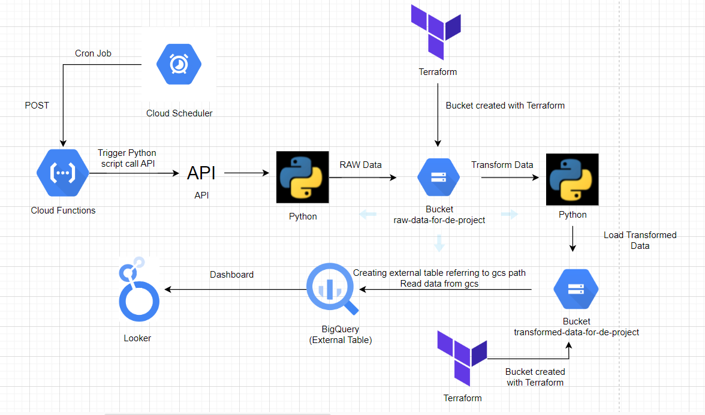
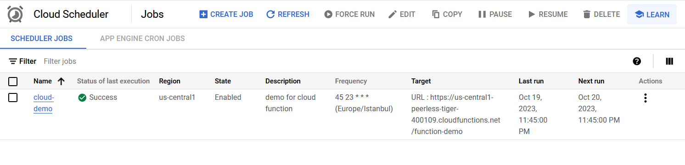
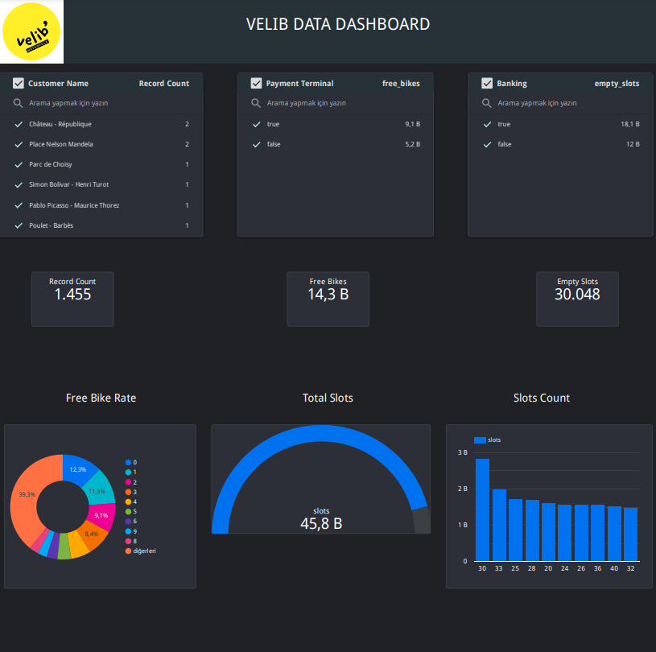
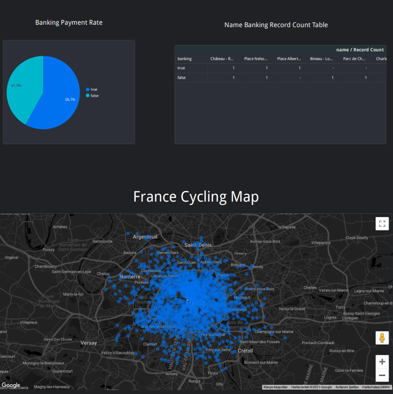

# Data-Engineering-Project
# Pipeline Diagram

# Project Summary

First, storage infrastructure was created using Terraform to create buckets. Then, a cron job was set up using Cloud Scheduler to automatically trigger a Cloud Function at a specific time each day. The extract_load_data.py script was deployed on Cloud Functions. When triggered, Cloud Scheduler automatically executes the deployed script on Cloud Functions. When triggered, it fetches data from an API, converts the incoming data to a CSV file, and writes it to the raw-data-for-de-project bucket. The raw data is transformed using the transform_data.py script, and the transformed data is loaded into the transformed-data-for-de-project bucket using the load_data_to_bucket.py script. An external table was created in BigQuery, and the data was read from the bucket into BigQuery before being visualized using Looker.

# Scheduler Jobs

# Dashboard

